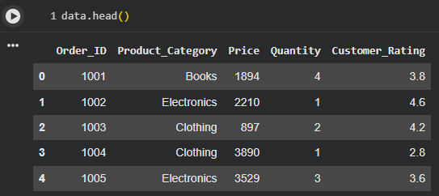
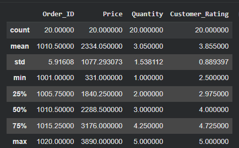
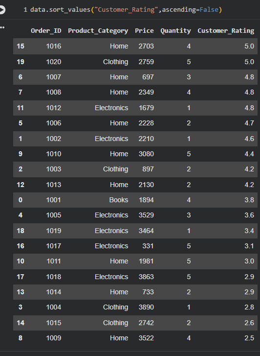

# 🛒 E-Commerce Sales Performance Analysis


---

# 📌 Project Overview

This project presents an exploratory analysis of an **E-Commerce Sales Dataset** using Python. It demonstrates essential data analysis techniques to extract meaningful insights from sales data, helping businesses understand product performance and make data-driven decisions.

Using **Pandas** and **NumPy**, the notebook explores the dataset, generates descriptive statistics, performs filtering and sorting operations, and derives valuable business insights from sales records.

---

# 🎯 Objectives

- Explore an E-Commerce sales dataset.
- Understand the structure and characteristics of the data.
- Perform descriptive statistical analysis.
- Analyze product pricing and customer ratings.
- Demonstrate filtering and sorting techniques using Pandas.
- Extract meaningful business insights from sales data.

---

# 📂 Dataset

The project uses the dataset:

```
commerce_sales_dataset.csv
```

The dataset contains information about products sold through an E-Commerce platform.

### Dataset Features

- Product Name
- Product Category
- Price
- Customer Rating
- Quantity Sold
- Sales Information

The dataset is included in this repository and is used for exploratory data analysis and statistical evaluation.

---

# 🚀 Features

- ✔️ Data Loading
- ✔️ Dataset Exploration
- ✔️ Descriptive Statistics
- ✔️ Data Filtering
- ✔️ Data Sorting
- ✔️ Sales Data Analysis
- ✔️ Business-Oriented Insights

---

# 🛠 Technologies Used

- Python
- Pandas
- NumPy
- Jupyter Notebook

---

# 📁 Repository Structure

```
E-Commerce-Sales-Performance/
│
├── Case_Study_E_commerce.ipynb
├── ecommerce_sales_dataset.csv
├── README.md
│
└── images/
    ├── README.md
    ├── data.png
    ├── dataset_statistics.png
    └── sales_analysis.png
```

---

# 📊 Project Results

## Dataset Preview

The following image displays a preview of the E-Commerce dataset used in this project.



---

## Dataset Statistics

The descriptive statistics summarize the numerical features of the dataset, including count, mean, standard deviation, minimum, maximum, and quartile values.



---

## Sales Analysis

The notebook performs sorting and filtering operations to analyze sales records and identify useful business information.



---

# ⚙️ Project Workflow

1. Import the required Python libraries.
2. Load the E-Commerce sales dataset.
3. Explore the dataset structure.
4. Generate descriptive statistics.
5. Perform sorting and filtering operations.
6. Analyze sales-related information.
7. Derive business insights from the dataset.

---

# 💡 Key Insights

- Explored the structure of an E-Commerce sales dataset.
- Generated descriptive statistics for numerical attributes.
- Performed filtering and sorting using Pandas.
- Analyzed product pricing and customer-related information.
- Demonstrated practical exploratory data analysis techniques.
- Derived insights that can support business decision-making.

---

# ▶️ How to Run

### 1. Clone the repository

```bash
git clone https://github.com/ruthushreeanoor/E-Commerce-Sales-Performance.git
```

### 2. Navigate to the project directory

```bash
cd E-Commerce-Sales-Performance
```

### 3. Install the required libraries

```bash
pip install pandas numpy jupyter
```

### 4. Launch Jupyter Notebook

```bash
jupyter notebook
```

### 5. Ensure the dataset file

```
commerce_sales_dataset.csv
```

is present in the project root directory.

### 6. Open

```
Case_Study_E_commerce.ipynb
```

Run all the notebook cells to reproduce the analysis.

---

# 📈 Learning Outcomes

This project demonstrates:

- Data Exploration
- Data Inspection
- Descriptive Statistics
- Data Filtering
- Data Sorting
- Exploratory Data Analysis (EDA)
- Business Data Interpretation
- Data Analysis using Pandas

---

# 📚 Future Enhancements

- Create interactive visualizations using Matplotlib and Seaborn.
- Build dashboards using Power BI or Tableau.
- Perform customer segmentation analysis.
- Develop sales forecasting models.
- Implement recommendation systems using Machine Learning.

---

# 👩‍💻 Author

**Ruthushree **

GitHub: https://github.com/ruthushreeanoor

---

## ⭐ Support

If you found this project useful, consider giving it a ⭐ on GitHub!

Feedback and contributions are always welcome.
